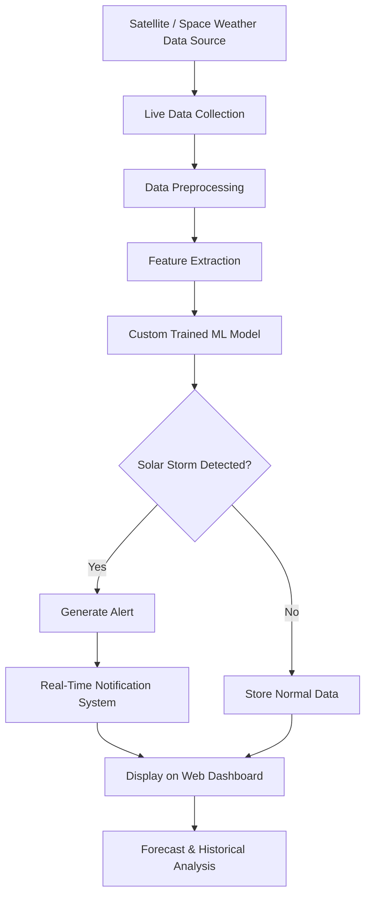

# ☀️ Solar Storm Detection & Real-Time Alert System

An AI-powered Solar Storm Monitoring System that detects solar storm activity in real time using live space weather data, machine learning models, and anomaly detection techniques. The system preprocesses incoming solar data, predicts abnormal patterns, and instantly sends alerts when potential solar storms are detected.

---

# 🚀 Features

- ☀️ Real-time solar storm monitoring
- 📡 Live space weather data processing
- 🧠 Custom trained Machine Learning model
- 📊 Data preprocessing and anomaly detection
- ⚠️ Instant real-time alert system
- 📈 Forecast visualization and prediction graphs
- 🌐 Web dashboard for monitoring
- 🗂 Historical data analysis support

---

# 🛠️ Technologies Used

## Programming Languages
- Python
- PHP
- JavaScript
- HTML
- CSS

## Libraries & Tools
- TensorFlow / Keras
- Random Forest Classifier
- LSTM Model
- NumPy
- Pandas
- Matplotlib

---

# 📂 Project Structure

```bash
SolarStrom/
│
├── src/
│   ├── anomalies/
│   │   ├── training/
│   │   └── forecast/
│   │
│   ├── ml/
│   │   ├── live_predict.py
│   │   ├── random_forest_classifier.py
│   │   ├── lstm_andrew_clean.py
│   │   └── trained_models/
│   │
│   └── web/
│       ├── index.php
│       ├── forecast.php
│       ├── history.php
│       ├── script.js
│       └── style.css
│
└── README.md
```

---

# ⚙️ Workflow Diagram



---

# 🔍 How It Works

1. The system continuously collects live solar and space weather data.
2. Incoming data is cleaned and preprocessed.
3. Important features are extracted for prediction.
4. The trained LSTM and Random Forest models analyze the data.
5. If abnormal solar activity is detected, the system triggers alerts.
6. Results are displayed on the monitoring dashboard in real time.

---

# 📊 Machine Learning Models

## LSTM Model
Used for time-series forecasting and prediction of solar activity trends.

## Random Forest Classifier
Used for anomaly classification and solar storm detection.

---

# 🎥 Demo Video

[](YOUR_VIDEO_LINK_HERE)


---

# 📈 Output

- Real-time solar storm alerts
- Historical activity analysis
- Live monitoring dashboard

---

# ▶️ How to Run

## Clone the Repository

```bash
git clone https://github.com/vrxayush/SolarStrom.git
cd SolarStrom
```

## Install Dependencies

```bash
pip install -r requirements.txt
```

## Run ML Prediction

```bash
python src/ml/live_predict.py
```

## Start Web Dashboard

Run the PHP server:

```bash
php -S localhost:8000
```

Then open:

```bash
http://localhost:8000
```

---

# 🎯 Future Improvements


- Mobile application support
- Advanced deep learning models
- Improved forecasting accuracy

---

# 📌 About

A real-time AI-based solar storm detection system that uses machine learning and anomaly detection to monitor, analyze, and predict solar activity with instant alerts.  


---

# 👨‍💻 Author


Ayush Shah  
Computer Science Engineering Student  
Interest: Cyber Security, AI, IoT & Software Development
